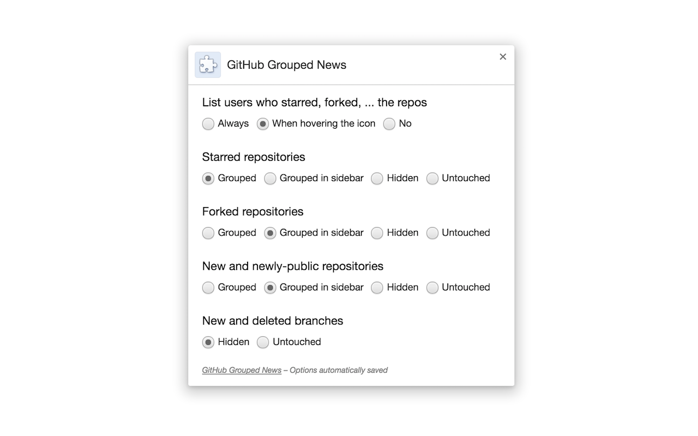

# GitHub Clean Feed  

> Chrome/Firefox extension: Group news feed by repo. [Download for Chrome](https://chrome.google.com/webstore/detail/github-clean-feed/failppjoidijbialknplliogdmabniaf) or [Firefox](#firefox)

## Chrome

https://chrome.google.com/webstore/detail/github-clean-feed/failppjoidijbialknplliogdmabniaf

## Firefox

It will soon be on AMO; until then:

1. `git clone https://github.com/bfred-it/github-clean-feed.git`
2. `cd github-clean-feed; npm install; npm run build`
3. Visit `about:debugging#addons` in Firefox
4. Click on **Load Temporary Add-on**
5. Select the file `browser/manifest.json`

## Opera

You can install the Chrome extension in Opera by using [`Download Chrome Extension`](https://addons.opera.com/en/extensions/details/download-chrome-extension-9/?display=en)
