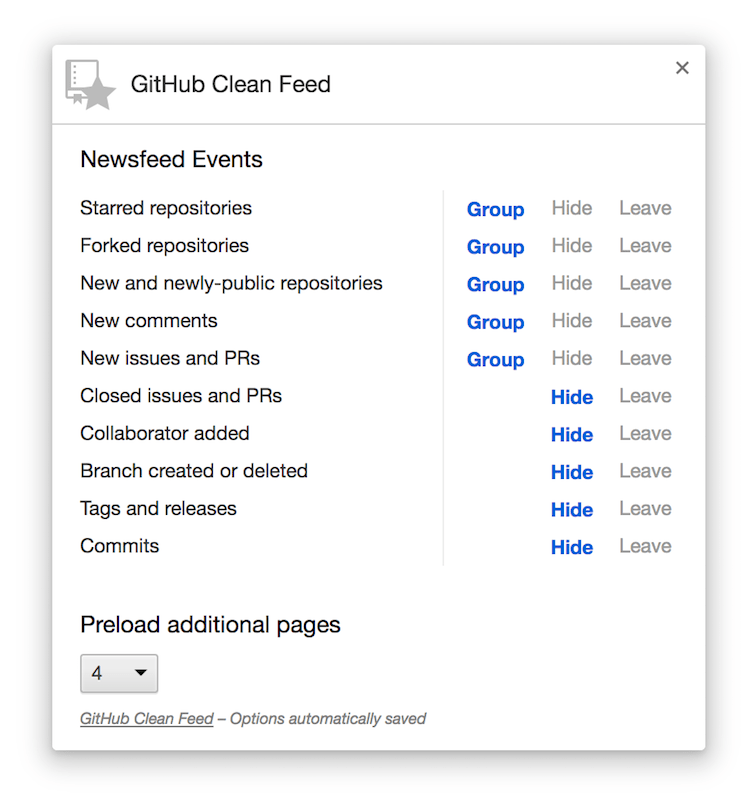

# GitHub Clean Feed  [![Chrome version][badge-cws]][link-cws] [![Firefox version][badge-amo]][link-amo] [![Autodeployment][badge-travis]][link-travis]

  [badge-cws]: https://img.shields.io/chrome-web-store/v/failppjoidijbialknplliogdmabniaf.svg?label=for%20chrome
  [badge-amo]: https://img.shields.io/amo/v/github-clean-feed.svg?label=for%20firefox
  [badge-travis]: https://img.shields.io/travis/bfred-it/github-clean-feed/master.svg?label=autodeployment
  [link-cws]: https://chrome.google.com/webstore/detail/github-clean-feed/failppjoidijbialknplliogdmabniaf "Version published on Chrome Web Store"
  [link-amo]: https://addons.mozilla.org/en-US/firefox/addon/github-clean-feed/ "Version published on Mozilla Add-ons"
  [link-travis]: https://travis-ci.org/bfred-it/github-clean-feed

> Group news feed events by repo. [Download for Chrome](https://chrome.google.com/webstore/detail/github-clean-feed/failppjoidijbialknplliogdmabniaf) or [Firefox](https://addons.mozilla.org/en-US/firefox/addon/github-clean-feed/)

 

## Install

  + [**Chrome** extension](https://chrome.google.com/webstore/detail/github-clean-feed/failppjoidijbialknplliogdmabniaf)
  + [**Firefox** add-on](https://addons.mozilla.org/en-US/firefox/addon/github-clean-feed/)
  + Opera - You can install the Chrome extension by installing [this Opera extension](https://addons.opera.com/en/extensions/details/download-chrome-extension-9/) first.
